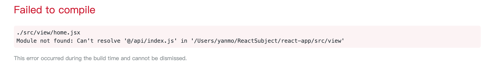

## react-building-project-shell

1、这是一个快速搭建react项目的shell文件，他会在根目录下新建一个文件夹`ReactSubject`,并在'~/ReactSubject'下创建一个react项目：

```
sh react-building-project-shell.sh
```


2、在创建的react项目，根目录下的/config/webpack.config.js 文件中，找到 alias 的配置:

>注意：旧版是/config/webpack.config.dev.js 文件和 /config/webpack.config.prod.js 文件中，找到 alias 的配置

```
alias: {
  ...
  '@': path.join(__dirname, '..', 'src'), // 添加这段内容
}
```

没有配置的话，将会出现如下错误：



3.运行

```
npm start
```
